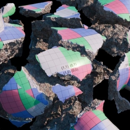
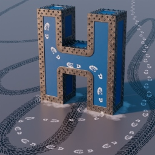

# Let's bring Houdini proceduralism to RenderMan!

### What is hGeoPatterns
**hGeoPatterns** is a collection of RenderMan plugins for sampling any Houdini compatible geometry. This project is a mixture of **RIS** and **HDK** functionality to make operations like sampling and reading arbitrary Houdini Geometry Data in RenderMan shading networks. Similar to familiar *xyzdist()*, *prim_attribute()*, *nearpoints()* VEX functions. OSL shaders, headers and VOP definitions are included to make shader authoring easy.

### Whats NEW
*:star:* Added Support for Packed geometry as well as Alembic and Usd.\
*:star:* New Utility Nodes added to simplify direct access to structure members.

### [Building and Installation](docs/Building.md)

### [Nodes Reference](docs/Reference.md)

### [Examples](https://alexeysmolenchuk.github.io/hGeoPatterns/)

### Limitations
* XPU not supported

Thanks to **SideFX** for the extensive library and **Pixar RenderMan** for supporting the RixPattern interface.
