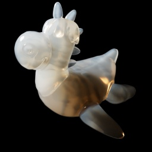
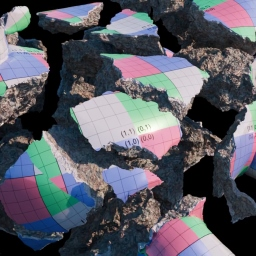
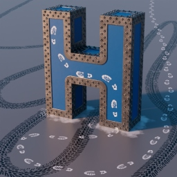

# Let's bring Houdini proceduralism to RenderMan!

### What is hGeoPatterns
**hGeoPatterns** is a collection of RenderMan plugins for sampling any Houdini compatible geometry. This project is a mixture of **RIS** and **HDK** functionality to make operations like sampling and reading arbitrary Houdini Geometry Data in RenderMan shading networks. Similar to familiar *xyzdist()*, *prim_attribute()*, *nearpoints()* VEX functions. OSL shaders, headers and VOP definitions are included to make shader authoring easy.

### Whats NEW
* **[displacementLayer](docs/displacementLayer.md)**
* **[pointCloudFilter](docs/pointCloudFilter.md)**

### [Docs](docs/Reference.md)

### [Examples](https://github.com/AlexeySmolenchuk/hGeoPatterns/releases) in .hipnc from [demo page](https://alexeysmolenchuk.github.io/hGeoPatterns/)

### [Installation](docs/Installation.md)

### [Building](docs/Building.md)

### Limitations
* XPU not supported

Thanks to **SideFX** for the extensive library and **Pixar RenderMan** for supporting the RixPattern interface.
