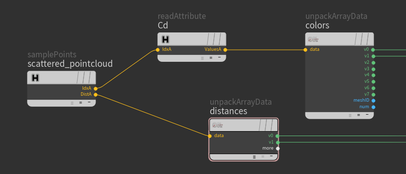
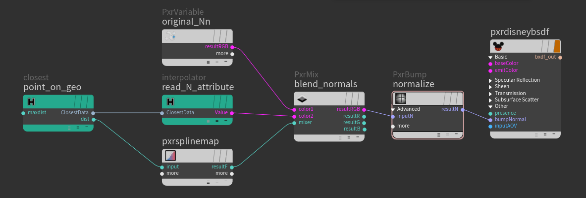
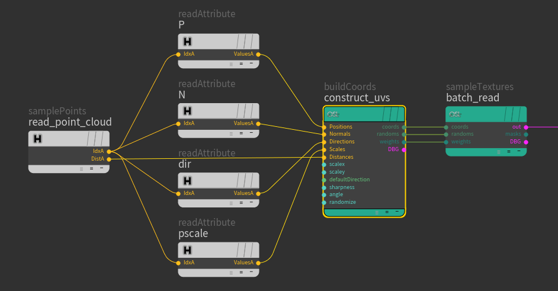
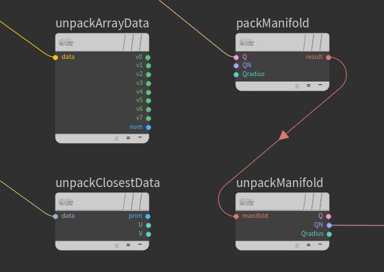

[HOME](../Readme.md)

# RIS Patterns / c++ plugins

Allows you to read data from any Houdini known geometry directly. This could be PrimPoly, PolySoups, Curves as well as Packed primitives, AlembicRefs and UsdRefs from **.bgeo**, **.bgeo.sc** or any other format which Houdini can digest e.g. **.abc** or **.usd**.*:star:*

## Point Cloud Specific

### SamplePoints
Allows you to sample the closest points from the file and store their sorted indexes and distances in the **ArrayData** structure for further reading. Similar to **pcopen**/**nearpoints** vex functions.

### ReadAttribute
Read specified point attributes from **ArrayData** structure indexes.
An empty filename means using the same file.
 

## Closest Point Specific

### Closest
The plugin is similar to the **xyzdist** vex function. It allows you to find the closest point on the surface/spline and store it in the **ClosestData** structure for further reading.

### Interpolator
Read interpolated attribute value from geometry at point matching the **ClosestData** structure. Similar to the **prim_attribute** vex function.
An empty filename means using the same file.
  

# OSL Patterns / Shaders
OSL shaders here are very simple examples demonstrating how you can manipulate results from samplers to build procedural effects.

### BuildCoords
Utility shader for building array of uv's from point-cloud-like data.

### SampleTexture
Utility shader for batch reading textures from an array of uv's.
  

# Utility Nodes *:star:*

### UnpackArrayData
Utility node to direct access to ArrayData structure members.
### UnpackClosestData
Utility node to direct access to ClosestData structure members.
### UnpackManifold
Utility node to direct access to RenderMan Manifold structure members.
### PackManifold
Utility node to define RenderMan compatible Manifold.
  

# VOP structures
Custom structures are defined in C++ and OSL headers. They are also defined as a Houdini Vop type in *vop/structs.json*, which allows you to work with those structures in **OSL Generic Shader Builder**.
There also structure for RenderMan Manifold inputs.
  

# Note about derivatives in OSL and RIS
The derivative calculation is required for Bump Mapping and Mip-Map optimization. RIS and OSL have very different mechanisms of derivative calculation in RenderMan. Be careful when using C++/RIS results as texture coordinates With OSL textures. Check if it works with **Dx()**, and **Dy()** functions or manually control texture filtering with the **width** parameter.

[HOME](../Readme.md)
