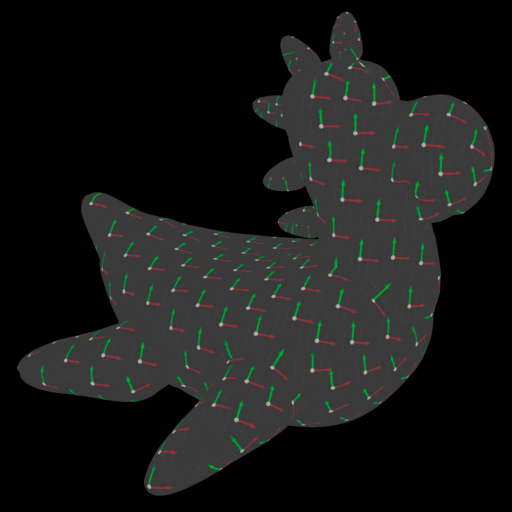
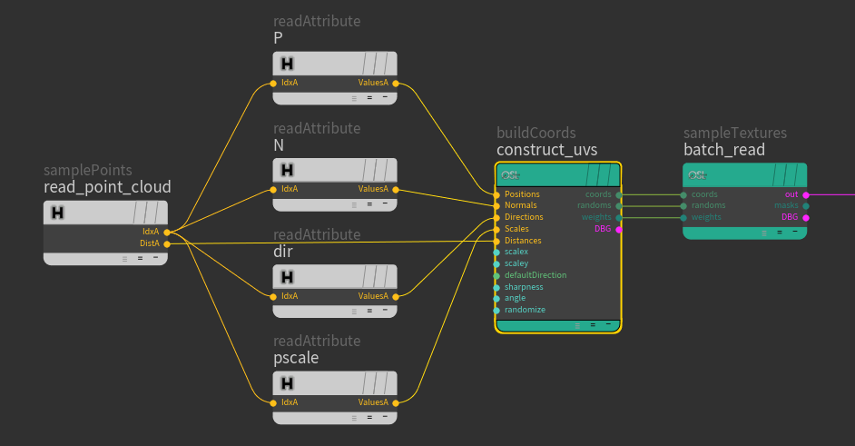

### [HOME](../Readme.md) / [Reference](Reference.md) / buildCoords

OSL shader

Building array of uv's from **[ArrayData](../osl/include/hGeoStructsOSL.h)** structures. Based on Positions, Normals, Directions etc. for fine control.
Can be used for point cloud based texture bombing.

Use **[sampleTextures](sampleTextures.md)** to perform efficient lookup from generated coords.

