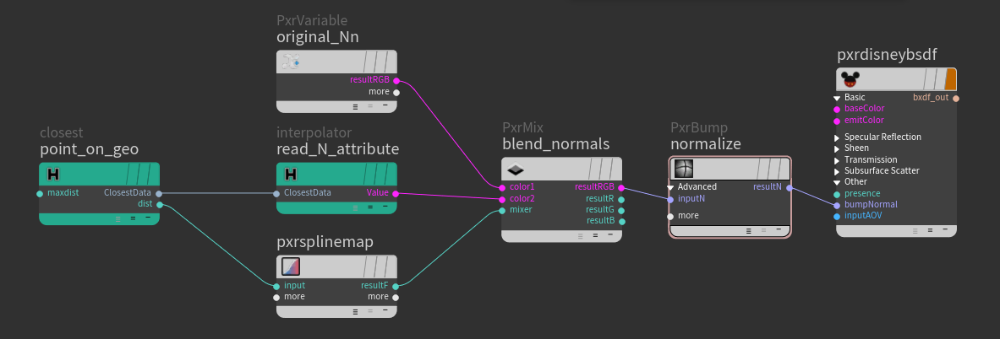

### [HOME](../Readme.md) / [Reference](Reference.md) / interpolator

C++ plugin

Outputs interpolated attribute value defined in **[ClosestData](../osl/include/hGeoStructsOSL.h)** structure. Similar to the **prim_attribute** VEX function.

An empty filename means using the same file.

Allows you to read data from any Houdini known geometry. This could be PrimPoly, PolySoups, Curves as well as Packed primitives, AlembicRefs and UsdRefs from **.bgeo**, **.bgeo.sc** or any other format which Houdini can digest e.g. **.abc** or **.usd**.
