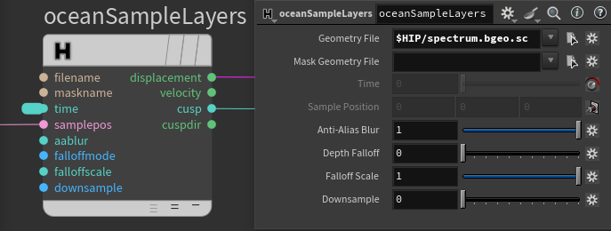

### [HOME](../Readme.md) / [Reference](Reference.md) / oceanSampleLayers

C++ plugin

Allows rendering of native Houdini ocean spectrums. Gives you identical to Mantra/Karma result because internally it calls VEX code in special CVEX_Context.

Use `displacement` output as vector displacement.
Due to batched execution of RenderMan shaders, the overhead is negligible. However, when `cusp` output used in shading network - spectrum file evaluates per shading sample, not per micropolygon.

Activate displacement by increasing `primvars:ri:attributes:displacementbound:sphere`

Disable `primvars:ri:attributes:dice:rasterorient` for better results.

Check [example](https://github.com/AlexeySmolenchuk/hGeoPatterns/releases) from latest release.

