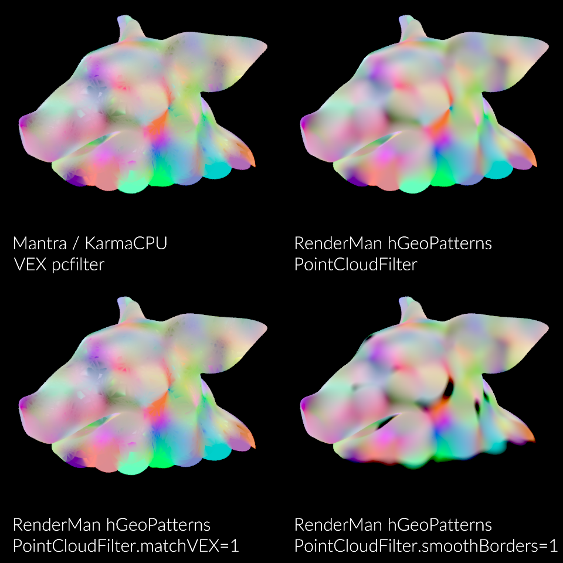
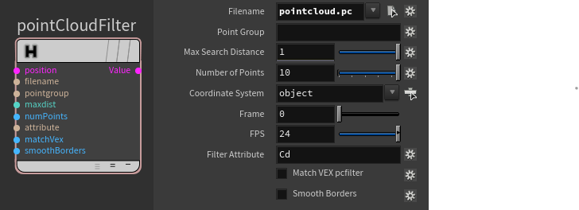

### [HOME](../Readme.md) / [Reference](Reference.md) / pointCloudFilter

C++ plugin

Implements **pcopen > pcfilter** functionality in one shader. It can produce results matching to VEX pcfilter or compute smoother and continuous results with alternative filters.

Allows you to read data from any Houdini known geometry. It can be unconnected points or points from PrimPoly, PolySoups, Curves as well as Packed primitives, AlembicRefs and UsdRefs from `.pc`, `.bgeo`, `.bgeo.sc` or any other format which Houdini can digest e.g. ``.abc`` or ``.usd``.
