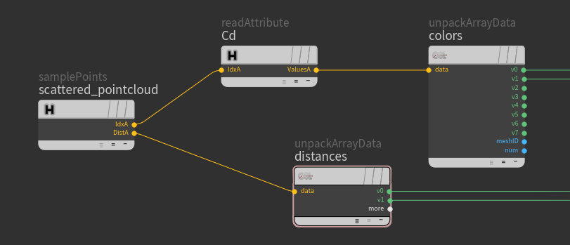

### [HOME](../Readme.md) / [Reference](Reference.md) / readAttribute

C++ plugin

Outputs attribute values for specified indexes.
Read specified point attributes from **[ArrayData](../osl/include/hGeoStructsOSL.h)** indexes.

You can read values for up to 16 points.
An empty filename means using the same file.

Allows you to read data from any Houdini known geometry. It can be unconnected points or points from PrimPoly, PolySoups, Curves as well as Packed primitives, AlembicRefs and UsdRefs from `.pc`, `.bgeo`, `.bgeo.sc` or any other format which Houdini can digest e.g. ``.abc`` or ``.usd``.
