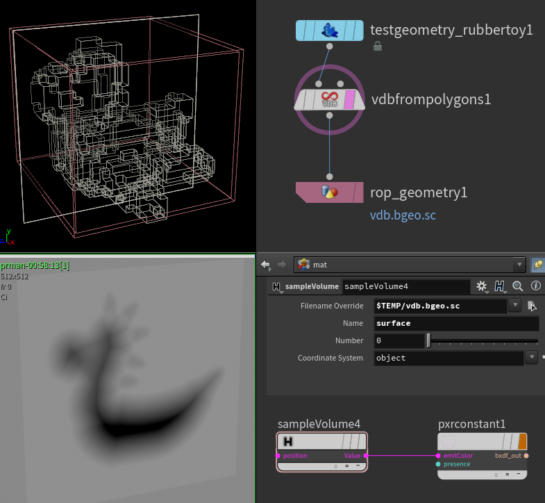

### [HOME](../Readme.md) / [Reference](Reference.md) / sampleVolume

C++ plugin

Volume Sampler for both VDB and native Houdini volumes. Allows you to read value of specified field in arbitrary coordinate.

