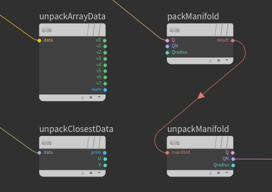

### [HOME](../Readme.md) / [Reference](Reference.md) / Utility Nodes

OSL shaders

### UnpackArrayData
Utility node to direct access to ArrayData structure members.

### UnpackClosestData
Utility node to direct access to ClosestData structure members.

### UnpackManifold
Utility node to direct access to RenderMan Manifold structure members.

### PackManifold
Utility node to define RenderMan compatible Manifold.
